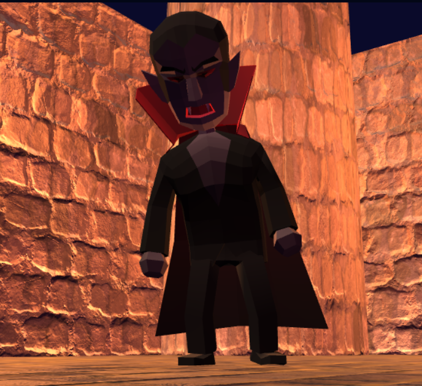

🧛# Bloodline Duel🧛

**Bloodline Duel** — это многопользовательская 3D-игра про дуэли вампиров в мрачной арене. Проект собран на **Three.js**, **Socket.IO**, **Node.js** и **PostgreSQL**.

Игроки двигаются по арене, атакуют друг друга в ближнем бою, используют ультимативную способность с летучими мышами, а статистика побед, поражений, убийств и смертей сохраняется в базе данных.

---

## Что умеет игра

- Мультиплеер в реальном времени
- Дуэли с раундами
- Обычная атака и ульта
- Респаун между раундами
- Кровавые следы и эффекты попадания
- Блокировка движения через столкновения с объектами арены
- Таблица лидеров на основе PostgreSQL
- 3D-модели персонажей и анимации через FBX

---

## 🩸Скрин проекта🩸

<div align="center">
    
</div>

---

## Управление

- **W / A / S / D** — движение
- **ЛКМ по другому игроку** — атака
- **E** — ультимативная способность
- **Кнопка “Топ игроков”** — показать или скрыть таблицу лидеров

---

## Геймплей

### Дуэли
Игроки попадают в дуэльный матч и сражаются раундами. После смерти один из участников получает очко, затем начинается новый раунд. Победитель дуэли определяется по итоговому счёту.

### Атака
При клике по другому игроку выполняется обычная атака. Если противник находится достаточно близко, он получает урон.

### Ульта
Ультимативная способность выпускает снаряды-летучих мышей. При попадании они наносят урон врагу.

### Статистика
В PostgreSQL сохраняются:
- победы
- поражения
- убийства
- смерти
- время последнего подключения

---

## Технологии

### Клиент
- Three.js
- OrbitControls
- FBXLoader
- Socket.IO Client

### Сервер
- Node.js
- Express
- Socket.IO
- PostgreSQL

### Хранение данных
- Таблица `players`
- Сохранение статистики игроков
- Лидерборд на основе базы данных

---

## Структура проекта

```text
client/
  index.html
  js/
    classes/
       BatProjectiles.js
       BloodFootSteps.js
       BloodParticles.js
       CombatController.js
       GameLoop.js
       InputManager.js
       Lighting.js
       PlayerController.js
       VampirePlayer.js
    loaders/
        TextureManager.js
    network/
        SocketHadlers.js
    ui/
        UI.js
    world/
        Arena.js
server/
  index.js
  database.js
  game/
    Player.js
    Duel.js
    GameManager.js
  socket/
    socketHandler.js
```

---

## База данных

Используется таблица `players`.

Поля:

- `id` — идентификатор игрока
- `nickname` — никнейм
- `wins` — победы
- `losses` — поражения
- `kills` — убийства
- `deaths` — смерти
- `last_seen` — время последнего подключения

---

## Основные события Socket.IO

### Клиент → сервер
- `player-move`
- `player-attack`
- `player-ultimate-hit`
- `player-ultimate-cast`
- `get-leaderboard`

### Сервер → клиент
- `current-players`
- `player-connected`
- `player-disconnected`
- `player-moved`
- `player-hurt`
- `player-respawn`
- `player-died`
- `round-start`
- `round-end`
- `duel-start`
- `duel-finished`
- `leaderboard`
- `player-attack-animation`
- `player-ultimate-animation`
- `player-ultimate-cast`

---

## Локальный запуск

### 1. Установить зависимости
```bash
npm install
```

### 2. Запустить сервер
```bash
npm start
```

После запуска откройте адрес, который будет указан в консоли.

---

## Переменные окружения

Для локального запуска и деплоя рекомендуется использовать `.env`.

Пример:

```env
DB_HOST=localhost
DB_PORT=5432
DB_USER=postgres
DB_PASSWORD=your_password
DB_NAME=vampire_duel
```

---

## Деплой

Проект готовится к публикации на **Render**.


---

## Статус проекта

Текущая версия уже содержит:
- рабочий multiplayer
- систему дуэлей
- leaderboard
- сохранение статистики
- базовую подготовку к деплою

---

